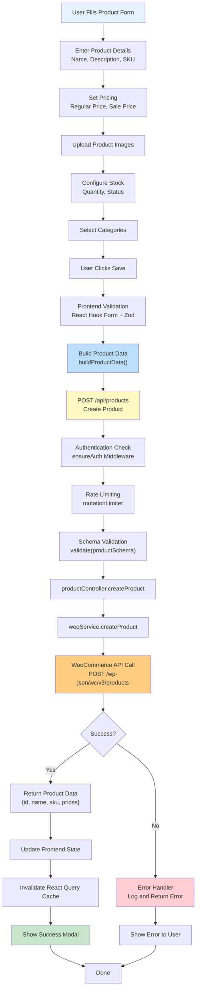
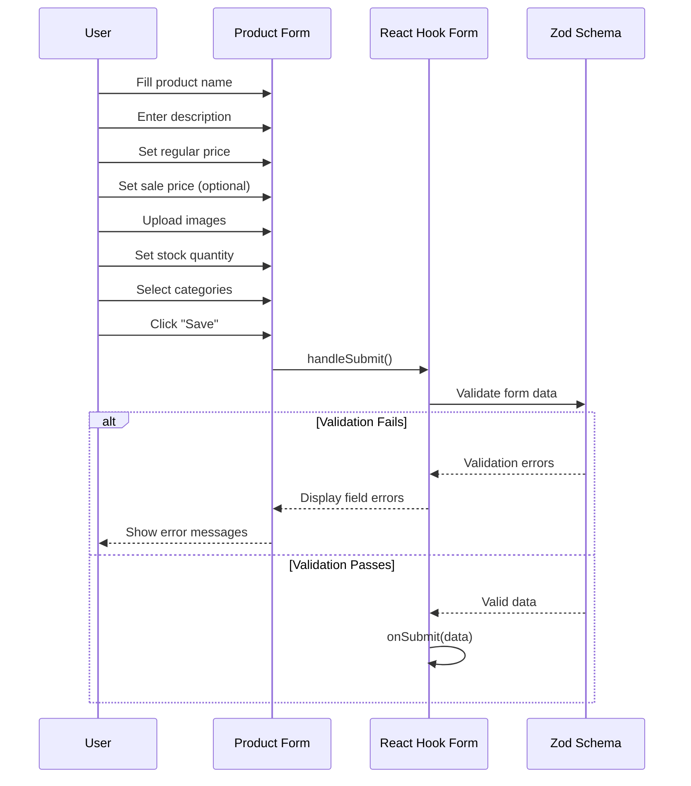
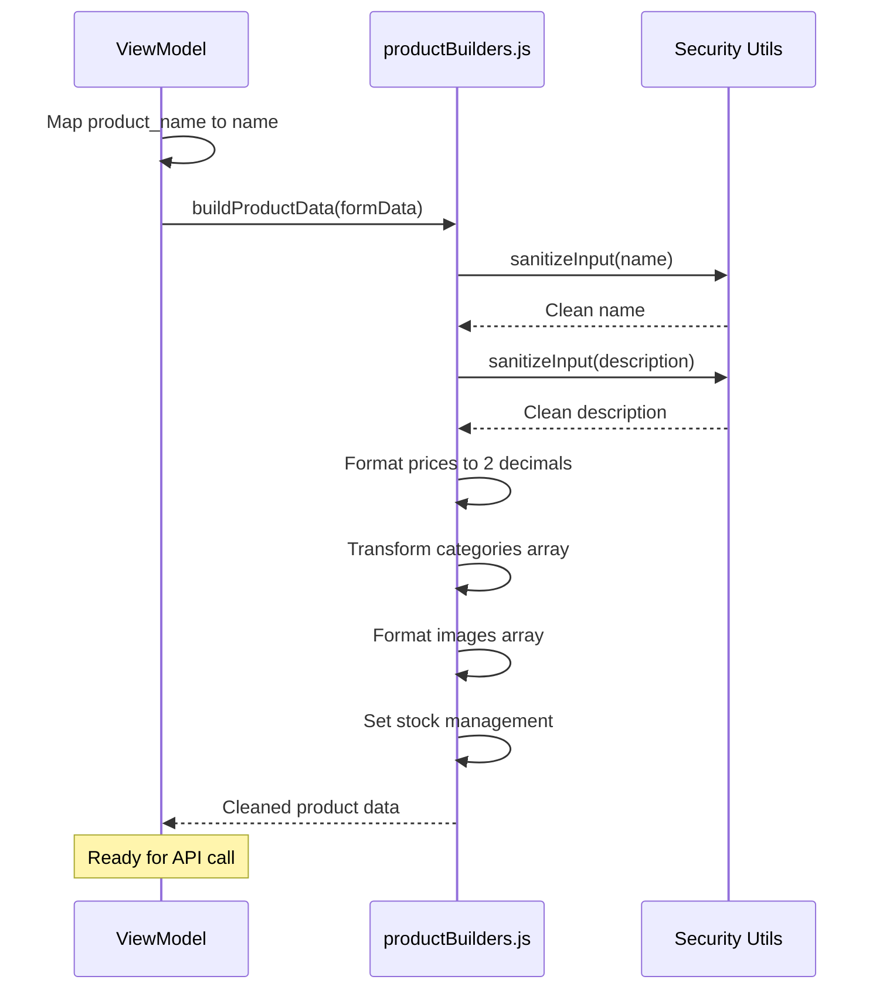
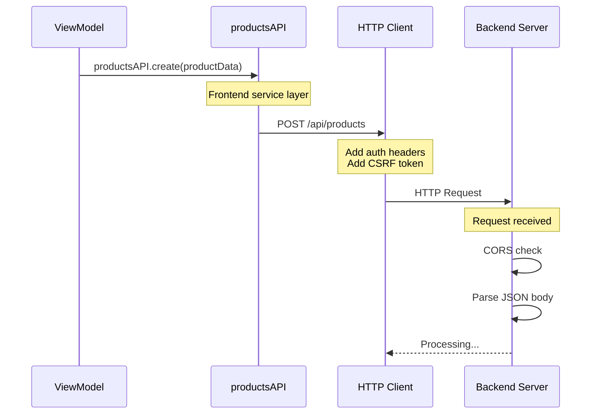
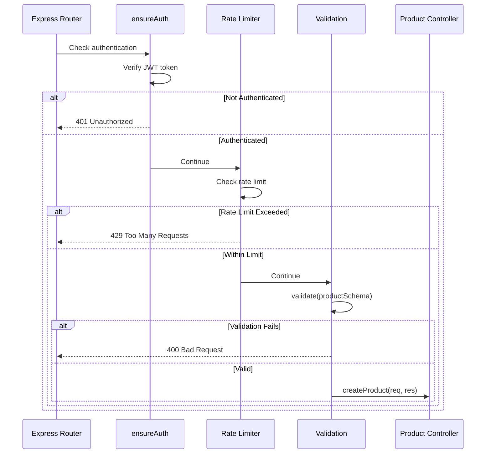
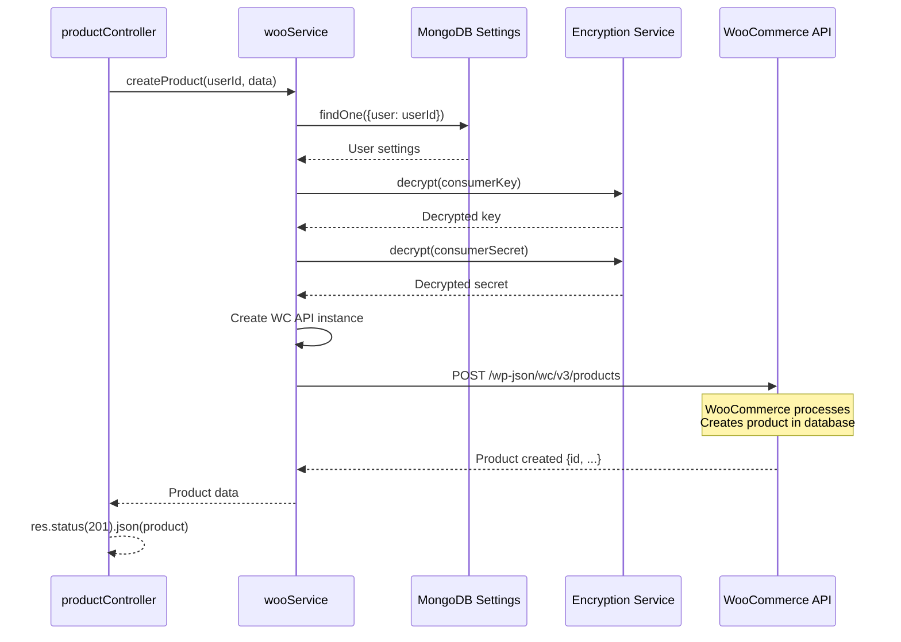
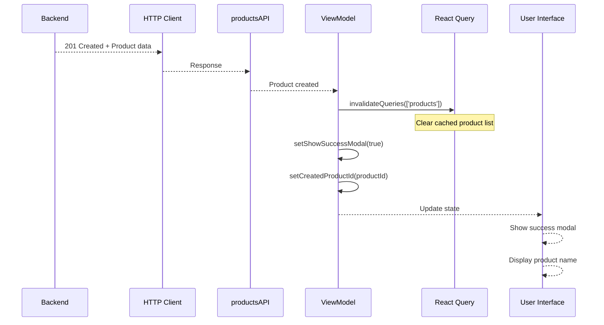
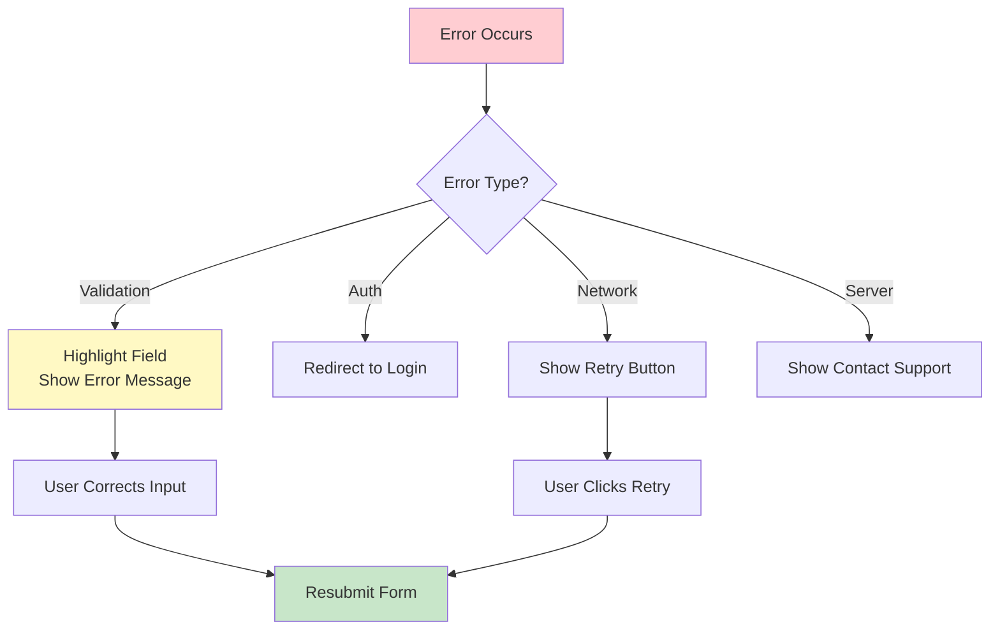

# Simple Product Upload - Detailed Flow

## Complete Simple Product Creation Flow



## Detailed Step-by-Step Process

### Phase 1: User Input & Form Validation



### Phase 2: Data Transformation



### Phase 3: API Request Flow



### Phase 4: Backend Processing



### Phase 5: WooCommerce Integration



### Phase 6: Response & UI Update



## Data Transformation Examples

### Input: Form Data
```javascript
{
  product_name: "Wireless Mouse",
  status: "publish",
  type: "simple",
  description: "High-quality wireless mouse",
  short_description: "Wireless mouse with ergonomic design",
  regular_price: "49.99",
  sale_price: "39.99",
  sku: "WM-001",
  manage_stock: true,
  stock_quantity: "100",
  stock_status: "instock",
  categories: [15, 23],
  images: [
    { id: 12345 },
    { id: 12346 }
  ]
}
```

### After buildProductData()
```javascript
{
  name: "Wireless Mouse",  // Mapped from product_name
  status: "publish",
  type: "simple",
  description: "High-quality wireless mouse",
  short_description: "Wireless mouse with ergonomic design",
  regular_price: "49.99",
  sale_price: "39.99",
  sku: "WM-001",
  manage_stock: true,
  stock_quantity: "100",
  stock_status: "instock",
  categories: [
    { id: 15 },
    { id: 23 }
  ],
  images: [
    { id: 12345 },
    { id: 12346 }
  ]
}
```

### After Backend Sanitization
```javascript
{
  name: "Wireless Mouse",  // XSS cleaned
  status: "publish",
  type: "simple",
  description: "High-quality wireless mouse",  // HTML stripped
  short_description: "Wireless mouse with ergonomic design",
  regular_price: "49.99",
  sale_price: "39.99",
  sku: "WM-001",  // Sanitized
  manage_stock: true,
  stock_quantity: "100",
  stock_status: "instock",
  categories: [
    { id: 15 },
    { id: 23 }
  ],
  images: [
    { id: 12345 },
    { id: 12346 }
  ]
}
```

### WooCommerce Response
```javascript
{
  id: 67890,
  name: "Wireless Mouse",
  slug: "wireless-mouse",
  permalink: "https://store.com/product/wireless-mouse",
  type: "simple",
  status: "publish",
  description: "High-quality wireless mouse",
  short_description: "Wireless mouse with ergonomic design",
  sku: "WM-001",
  price: "39.99",  // Current price (sale price)
  regular_price: "49.99",
  sale_price: "39.99",
  on_sale: true,
  stock_quantity: 100,
  stock_status: "instock",
  manage_stock: true,
  categories: [
    { id: 15, name: "Electronics", slug: "electronics" },
    { id: 23, name: "Accessories", slug: "accessories" }
  ],
  images: [
    {
      id: 12345,
      src: "https://store.com/wp-content/uploads/image1.jpg",
      name: "image1.jpg"
    },
    {
      id: 12346,
      src: "https://store.com/wp-content/uploads/image2.jpg",
      name: "image2.jpg"
    }
  ],
  date_created: "2025-12-17T18:00:00",
  date_modified: "2025-12-17T18:00:00"
}
```

## Validation Rules

### Frontend Validation (Zod Schema)
```javascript
productSchema = z.object({
  product_name: z.string().min(1, "Product name is required"),
  status: z.enum(['draft', 'publish', 'private', 'pending']),
  type: z.enum(['simple', 'variable', 'grouped', 'external']),
  regular_price: z.string().optional(),
  sale_price: z.string().optional(),
  sku: z.string().optional(),
  stock_quantity: z.string().optional(),
  categories: z.array(z.number()).optional(),
  images: z.array(z.object({ id: z.number() })).optional()
}).superRefine((data, ctx) => {
  // If status is 'publish' and type is 'simple'
  if (data.status === 'publish' && data.type === 'simple') {
    if (!data.regular_price) {
      ctx.addIssue({
        code: z.ZodIssueCode.custom,
        message: 'Regular price is required for published products',
        path: ['regular_price']
      });
    }
  }
});
```

### Backend Validation (Zod Schema)
```javascript
productSchema = z.object({
  name: z.string().min(1),  // Required
  type: z.enum(['simple', 'variable', 'grouped', 'external']),
  status: z.enum(['draft', 'publish', 'private', 'pending']),
  regular_price: priceSchema,  // Optional but validated format
  sale_price: priceSchema,
  sku: z.string().optional(),
  manage_stock: z.boolean().default(true),
  stock_quantity: z.union([z.string(), z.number(), z.null()]).optional()
});
```

## Error Handling

### Common Errors & Solutions

| Error | Cause | Solution |
|-------|-------|----------|
| **400 Bad Request** | Validation failed | Check required fields, price format |
| **401 Unauthorized** | Invalid/expired token | Re-authenticate user |
| **409 Conflict** | Duplicate SKU | Use unique SKU or leave empty |
| **429 Too Many Requests** | Rate limit exceeded | Wait before retrying |
| **500 Server Error** | WooCommerce issue | Check WooCommerce settings |

### Error Flow



## Key Files in Flow

| Layer | File | Purpose |
|-------|------|---------|
| **UI** | `AddProductView.jsx` | Form display |
| **Logic** | `useAddProductViewModel.js` | Business logic |
| **Transform** | `productBuilders.js` | Data transformation |
| **Schema** | `product.js` (frontend) | Form validation |
| **API** | `woocommerce.js` | HTTP client |
| **Routes** | `api.js` | Route definitions |
| **Middleware** | `auth.js`, `validate.js`, `rateLimiter.js` | Security layers |
| **Controller** | `productController.js` | Request handling |
| **Service** | `wooService.js` | WooCommerce integration |
| **Schema** | `product.js` (backend) | API validation |

## Performance Considerations

### Frontend Optimizations
- **Form Validation:** Real-time validation with debouncing
- **Image Upload:** Compress before upload
- **Caching:** React Query with 15-minute stale time
- **Optimistic Updates:** Update UI before server confirmation

### Backend Optimizations
- **Rate Limiting:** Prevent abuse (10 requests/minute)
- **Connection Pooling:** Reuse database connections
- **Async Operations:** Non-blocking I/O
- **Error Logging:** Structured logging for debugging

## Security Measures

### Frontend Security
1. **Input Sanitization:** Remove HTML/script tags
2. **CSRF Protection:** Token validation
3. **XSS Prevention:** Escape user input
4. **File Upload:** Validate file types and sizes

### Backend Security
1. **Authentication:** JWT token verification
2. **Authorization:** User-specific data access
3. **Rate Limiting:** Prevent brute force
4. **Schema Validation:** Prevent injection attacks
5. **Encryption:** Secure credential storage

## Success Criteria

✅ Product created in WooCommerce  
✅ Product ID returned to frontend  
✅ UI updated with success message  
✅ Cache invalidated for fresh data  
✅ User can view product in list  

---

**Focus:** This diagram shows the complete simple product creation flow from form input to WooCommerce database.
