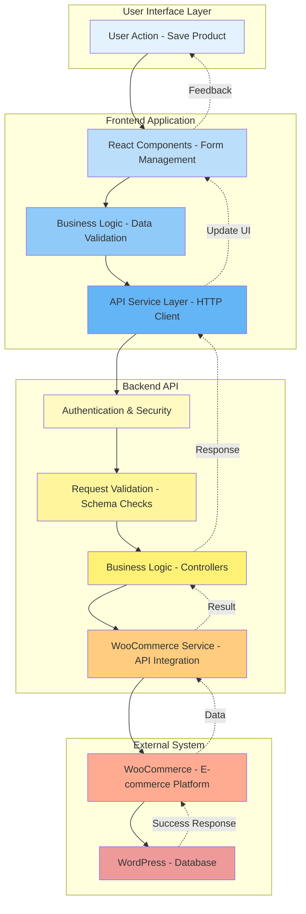
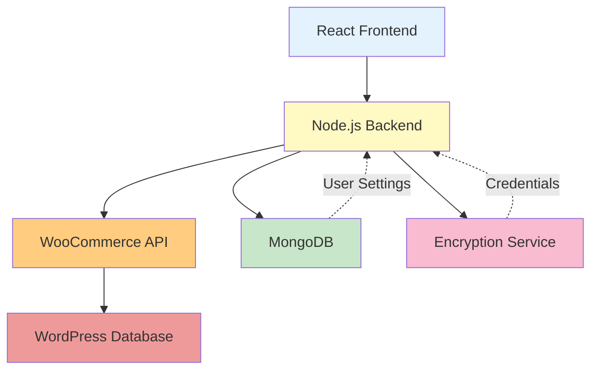

# Strategic Architecture Flow - Product Variation System

## High-Level System Overview



## Strategic Process Flow

```mermaid
graph LR
    subgraph "Phase 1: Preparation"
        A1["Collect User Input"]
        A2["Validate Form Data"]
        A3["Transform to API Format"]
    end
    
    subgraph "Phase 2: Parent Product"
        B1["Create/Update Parent Product"]
        B2["Wait for WooCommerce"]
        B3["Get Product ID"]
    end
    
    subgraph "Phase 3: Variations"
        C1["Process Each Variation"]
        C2["Send to WooCommerce"]
        C3["Collect Results"]
    end
    
    subgraph "Phase 4: Finalization"
        D1["Sync Parent Product Prices"]
        D2["Reload Fresh Data"]
        D3["Show Success to User"]
    end
    
    A1 --> A2 --> A3
    A3 --> B1 --> B2 --> B3
    B3 --> C1 --> C2 --> C3
    C3 --> D1 --> D2 --> D3
    
    style A1 fill:#e1f5ff
    style B1 fill:#fff9c4
    style C1 fill:#ffcc80
    style D1 fill:#c8e6c9
```



## Key Architectural Layers

### 1. **Presentation Layer** (Frontend)
- **Responsibility:** User interaction, form management, UI updates
- **Technology:** React, React Hook Form, Ant Design
- **Key Files:** `AddProductView.jsx`, `useAddProductViewModel.js`

### 2. **Application Layer** (Frontend Business Logic)
- **Responsibility:** Data transformation, validation, state management
- **Technology:** Custom hooks, utility functions
- **Key Files:** `productBuilders.js`, `variationUtils.js`

### 3. **API Gateway Layer** (Frontend Services)
- **Responsibility:** HTTP communication, error handling, request/response formatting
- **Technology:** Axios, API interceptors
- **Key Files:** `woocommerce.js`, `api.js`

### 4. **Security Layer** (Backend Middleware)
- **Responsibility:** Authentication, authorization, rate limiting, input validation
- **Technology:** Express middleware, Zod schemas
- **Key Files:** `auth.js`, `validate.js`, `rateLimiter.js`

### 5. **Business Logic Layer** (Backend Controllers)
- **Responsibility:** Request orchestration, business rules, response formatting
- **Technology:** Express controllers
- **Key Files:** `productController.js`, `variationController.js`

### 6. **Integration Layer** (Backend Services)
- **Responsibility:** External API communication, credential management
- **Technology:** WooCommerce REST API client
- **Key Files:** `wooService.js`

### 7. **Data Layer** (WooCommerce/WordPress)
- **Responsibility:** Data persistence, business logic execution
- **Technology:** WordPress database, WooCommerce plugins
- **External System:** WordPress + WooCommerce

## Data Flow Patterns

### Request Flow (Simplified)
```
User Input → Validation → Transformation → HTTP Request → 
Authentication → Schema Validation → Business Logic → 
WooCommerce API → Database → Response
```

### Response Flow (Simplified)
```
Database → WooCommerce → Service Layer → Controller → 
HTTP Response → Frontend Service → State Update → UI Refresh
```

## Critical Design Decisions

### 1. **Parent-First Pattern**
- Create parent product before variations
- Ensures WooCommerce has proper context
- Prevents orphaned variations

### 2. **Async Wait Strategy**
- 500ms delay after parent creation
- Allows WooCommerce to complete internal processing
- Prevents race conditions

### 3. **Partial Update Schema**
- Separate schemas for create vs update operations
- Allows flexible field requirements
- Improves API usability

### 4. **Clean Data Pattern**
- Sanitize and format before API calls
- Remove temporary/invalid fields
- Ensure API compatibility

### 5. **Error Boundary Strategy**
- Multiple error handling layers
- User-friendly error messages
- Detailed logging for debugging

## Security Considerations

### Frontend Security
- Input sanitization (XSS prevention)
- CSRF token validation
- Secure credential storage

### Backend Security
- JWT authentication
- Rate limiting (prevent abuse)
- Schema validation (data integrity)
- OAuth 1.0a for WooCommerce

## Performance Optimizations

### Frontend
- React Query caching (15-minute stale time)
- Lazy loading of variations
- Optimistic UI updates

### Backend
- Batch operations support
- Efficient database queries
- Connection pooling

## Scalability Patterns

### Horizontal Scaling
- Stateless backend design
- JWT-based authentication (no sessions)
- External credential storage

### Vertical Scaling
- Async operations
- Promise.all for parallel requests
- Efficient data structures

## Monitoring & Debugging

### Logging Strategy
- Color-coded console logs
- Emoji markers for easy scanning
- Step-by-step flow tracking

### Debug Levels
- 🔵 Frontend API calls
- 🟡 Backend controllers
- 🟠 WooCommerce service
- 🟢 Success states
- 🔴 Error states

## Future Enhancements

### Potential Improvements
1. **Webhook Integration** - Real-time WooCommerce updates
2. **Queue System** - Handle bulk operations
3. **Caching Layer** - Redis for frequently accessed data
4. **GraphQL API** - More flexible data fetching
5. **Real-time Validation** - Live SKU uniqueness checks

## System Dependencies



## Key Metrics to Monitor

1. **Response Time** - API call duration
2. **Success Rate** - Variation creation success %
3. **Error Rate** - Failed requests %
4. **User Actions** - Form submissions per hour
5. **WooCommerce Health** - API availability

---

**Document Version:** 1.0  
**Last Updated:** 2025-12-17  
**Maintained By:** Development Team
