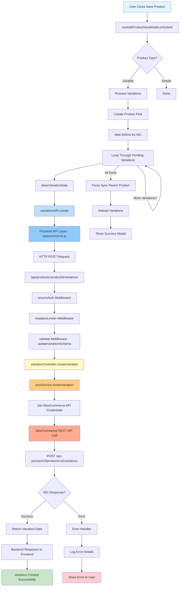

# Variation Creation Flow - Complete Process Map

This document maps out the complete flow of creating a product variation, from user interaction to WooCommerce API.

## Flow Diagram



## Detailed Step Breakdown

### 1. Frontend - User Action
**File:** `AddProductView.jsx` → `useAddProductViewModel.js`

```javascript
User clicks "Save" → handleSave(status) → onSubmit(data, status)
```

### 2. Frontend - Product Creation
**File:** `useAddProductViewModel.js` (lines 587-751)

1. Build product data with `buildProductData()`
2. Create/update product via `productsAPI.create/update()`
3. Store `createdProductId`

### 3. Frontend - Variation Processing
**File:** `useAddProductViewModel.js` (lines 627-690)

For each pending variation:
1. Clean data with `cleanVariationData(pendingVariation)`
2. Call `variationsAPI.create(productId, cleanedData)`

### 4. Frontend - API Service Layer
**File:** `woocommerce.js` (lines 546-559)

```
🔵 STEP 1: Log variation data
→ HTTP POST to /api/products/:productId/variations
🟢 STEP 2: Log response
```

### 5. Backend - Middleware Chain
**File:** `api.js` (lines 90-95)

```
Request → ensureAuth → mutationLimiter → validate(updateVariationSchema) → Controller
```

**Validation Schema:** `updateVariationSchema = variationSchema.partial()`
- Allows partial updates (no required fields)
- Located in: `src/schemas/product.js`

### 6. Backend - Controller Layer
**File:** `variationController.js` (lines 71-95)

```
🟡 STEP 1: Log request received
🟡 STEP 2: Call wooService.createVariation()
🟢 STEP 3: Log success
🟢 STEP 4: Send response to client
```

### 7. Backend - Service Layer
**File:** `wooService.js` (lines 363-371)

```
🟠 STEP 1: Log starting
🟠 STEP 2: Get WooCommerce API instance
🟠 STEP 3: Make WooCommerce API call
🟢 STEP 4: Log WooCommerce response
```

### 8. WooCommerce API
**Endpoint:** `POST /wp-json/wc/v3/products/:productId/variations`

**Authentication:** OAuth 1.0a (Consumer Key/Secret)

**Expected Response:**
```json
{
  "id": 12345,
  "sku": "VAR-SKU",
  "regular_price": "100.00",
  "sale_price": "80.00",
  "attributes": [
    {
      "id": 1,
      "name": "Color",
      "option": "Red"
    }
  ]
}
```

### 9. Response Flow Back

```
WooCommerce → wooService → variationController → Frontend API → useAddProductViewModel
```

### 10. Post-Creation Actions
**File:** `useAddProductViewModel.js` (lines 663-673)

1. Clear pending variations
2. Force sync parent product (update status to trigger WC price recalculation)
3. Reload variations from WooCommerce
4. Show success modal

## Key Data Transformations

### Frontend: buildVariationData()
**File:** `productBuilders.js`

Transforms form data to WooCommerce format:
```javascript
{
  regular_price: "100",
  sale_price: "80",
  sku: "VAR-001",
  attributes: { 1: 5 }  // attributeId: termId
}
↓
{
  regular_price: "100",
  sale_price: "80",
  sku: "VAR-001",
  attributes: [
    { id: 1, option: "Red" }  // Resolved term name
  ]
}
```

### Frontend: cleanVariationData()
**File:** `productBuilders.js`

Removes temporary/invalid fields before API call:
- Removes `id` if it starts with "temp-"
- Removes `image` if null
- Removes empty prices

## Error Handling Points

### 1. Validation Errors (Middleware)
- **Location:** `validate.js` middleware
- **Logged to:** `validation_debug.log`
- **Common Issue:** Missing required fields (before partial schema fix)

### 2. WooCommerce API Errors
- **Location:** `wooService.js`
- **Logged to:** `woocommerce_error.log`
- **Common Issues:**
  - Invalid SKU (duplicate)
  - Invalid attribute combinations
  - Missing parent product

### 3. Network Errors
- **Location:** Frontend `api.js` interceptors
- **Handling:** Retry logic, user-friendly messages

## Debug Logging Legend

| Emoji | Layer | Color | Meaning |
|-------|-------|-------|---------|
| 🔵 | Frontend API | Blue | Starting request |
| 🟢 | Success | Green | Operation succeeded |
| 🔴 | Error | Red | Error occurred |
| 🟡 | Backend Controller | Yellow | Controller layer |
| 🟠 | Backend Service | Orange | Service/WooCommerce layer |

## Critical Files Reference

### Frontend
- `AddProductView.jsx` - UI component
- `useAddProductViewModel.js` - Business logic
- `productBuilders.js` - Data transformation
- `woocommerce.js` - API service layer
- `api.js` - HTTP client with interceptors

### Backend
- `api.js` - Route definitions
- `variationController.js` - Request handler
- `wooService.js` - WooCommerce API client
- `product.js` - Validation schemas
- `validate.js` - Validation middleware

## Recent Fixes Applied

1. ✅ **Partial Schema Validation** - Created `updateVariationSchema` to allow partial updates
2. ✅ **Price Display Fix** - Fixed `productProcessing.js` to handle variable product pricing
3. ✅ **Demo Data Button** - Added quick test data population
4. ✅ **Comprehensive Logging** - Added step-by-step debug logs throughout the flow

## Next Steps for Debugging

1. **Restart backend server** (to apply schema changes)
2. **Open browser console** (F12)
3. **Click "Fill Demo Data"**
4. **Save product**
5. **Monitor logs** in both browser console and backend terminal
6. **Follow the emoji trail** to see where the request goes
