# Variation Product Upload - Detailed Flow

## Complete Variation Creation Flow


## Detailed Step-by-Step Process

### Phase 1: User Input & Preparation


### Phase 2: Parent Product Creation


### Phase 3: Variation Creation Loop

```mermaid
sequenceDiagram
    participant VM as ViewModel
    participant Clean as cleanVariationData
    participant API as variationsAPI
    participant Backend as Backend
    participant WC as WooCommerce
    
    loop For each pending variation
        VM->>Clean: cleanVariationData(variation)
        Note over Clean: Remove temp IDs<br/>Format prices<br/>Sanitize SKU<br/>Clean attributes
        
        Clean-->>VM: Cleaned data
        
        VM->>API: variationsAPI.create(productId, data)
        Note over API: 🔵 Frontend log:<br/>Starting variation creation
        
        API->>Backend: POST /api/products/12345/variations
        
        Backend->>Backend: ensureAuth
        Backend->>Backend: mutationLimiter
        Backend->>Backend: validate(updateVariationSchema)
        Note over Backend: 🟡 Controller log:<br/>Request received
        
        Backend->>Backend: variationController.createVariation
        Backend->>Backend: wooService.createVariation
        Note over Backend: 🟠 Service log:<br/>Calling WooCommerce API
        
        Backend->>WC: POST /wp-json/wc/v3/products/12345/variations
        
        WC-->>Backend: {id: 67890, sku: "VAR-001", ...}
        Note over Backend: 🟢 Success log:<br/>Variation created
        
        Backend-->>API: Variation data
        Note over API: 🟢 Frontend log:<br/>Response received
        
        API-->>VM: Success
    end
```



### Phase 4: Finalization & Sync


## Data Transformation Examples

### Input: User Form Data
```javascript
{
  product_name: "T-Shirt",
  type: "variable",
  regular_price: "100",
  attributes: {
    1: [5, 6],  // Color: Red, Blue
    2: [8, 9]   // Size: S, M
  }
}
```

### After buildProductData()
```javascript
{
  name: "T-Shirt",
  type: "variable",
  regular_price: "100.00",
  attributes: [
    {
      id: 1,
      name: "Color",
      options: ["Red", "Blue"],
      variation: true,
      visible: true
    },
    {
      id: 2,
      name: "Size",
      options: ["S", "M"],
      variation: true,
      visible: true
    }
  ]
}
```

### Generated Variations (Pending)
```javascript
[
  {
    id: "temp-gen-1734456789-abc",
    attributes: { 1: 5, 2: 8 },  // Red + S
    regular_price: "100",
    sku: ""
  },
  {
    id: "temp-gen-1734456789-def",
    attributes: { 1: 5, 2: 9 },  // Red + M
    regular_price: "100",
    sku: ""
  },
  // ... more combinations
]
```

### After cleanVariationData()
```javascript
{
  // id removed (was temporary)
  regular_price: "100.00",
  sale_price: "",
  sku: "",
  manage_stock: true,
  stock_quantity: null,
  stock_status: "instock",
  attributes: [
    { id: 1, name: "Color", option: "Red" },
    { id: 2, name: "Size", option: "S" }
  ]
}
```

### WooCommerce Response
```javascript
{
  id: 67890,
  sku: "VAR-001",
  regular_price: "100.00",
  sale_price: "",
  stock_quantity: null,
  attributes: [
    { id: 1, name: "Color", option: "Red" },
    { id: 2, name: "Size", option: "S" }
  ]
}
```

## Error Handling Points

### 1. Validation Errors (Before WooCommerce)
- **Location:** Backend `validate` middleware
- **Schema:** `updateVariationSchema.partial()`
- **Common Issues:** Invalid price format, missing attributes

### 2. WooCommerce API Errors
- **Location:** `wooService.createVariation`
- **Common Issues:**
  - Duplicate SKU
  - Invalid attribute combination
  - Parent product not ready

### 3. Network Errors
- **Location:** Frontend API interceptors
- **Handling:** Retry logic, user-friendly messages

## Key Files in Flow

| Layer | File | Purpose |
|-------|------|---------|
| **UI** | `AddProductView.jsx` | Form display |
| **Logic** | `useAddProductViewModel.js` | Business logic, orchestration |
| **Transform** | `productBuilders.js` | Data transformation |
| **API** | `woocommerce.js` | HTTP client |
| **Routes** | `api.js` | Route definitions |
| **Controller** | `variationController.js` | Request handling |
| **Service** | `wooService.js` | WooCommerce integration |
| **Schema** | `product.js` | Validation schemas |

## Debug Log Flow

```
🔵 [FRONTEND] variationsAPI.create - Starting
  ↓
🟡 [BACKEND-CONTROLLER] createVariation - Request received
  ↓
🟠 [BACKEND-SERVICE] createVariation - Calling WooCommerce
  ↓
🟢 [BACKEND-SERVICE] WooCommerce success
  ↓
🟢 [BACKEND-CONTROLLER] Response sent
  ↓
🟢 [FRONTEND] Response received
```

---

**Focus:** This diagram specifically shows the variation product upload process from start to finish.
